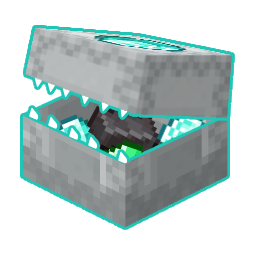

# Better Shulkers

- --
## About
Better Shulkers is an open-source Fabric and NeoForge Minecraft mod that works completely on the server (no client mod needed)
 and improves many aspects of shulker boxes. This is intended to be used on vanilla-compatible servers, however should work
 fine with modded content.

### This is Tater Certified's entry in the [2025 NeoForge Server-side Summer](https://neoforged.net/news/2025serversidesummer/) competition!

## Features
This is a brief list of features. More can be found on [our website](https://noramibu.github.io/Better-Shulkers/):
- Open shulker boxes from your hotbar
- Automatically pick up items and place them in a shulker box
- Whitelist certain items for a shulker box
- Visual display to show shulker box whitelists

## Downloads
Download Better Shulkers from [Curseforge](https://www.curseforge.com/minecraft/mc-mods/better-shulkers) or [Modrinth](https://modrinth.com/mod/better-shulkers).
The mod is compatible with Minecraft 1.21 and above.

## Showcase Video

## Configuration & Permissions

### Configuration Options
The mod creates a `bettershulkers.toml` file in your server's config folder. Here are all available options:

| Option                                            | Default  | Description                                                                                                                                                            |
|---------------------------------------------------|----------|------------------------------------------------------------------------------------------------------------------------------------------------------------------------|
| `disable-pickup-feature-of-shulkers`              | `false`  | Disables the main feature of this mod, which is shulkers retaining their inventory when broken. **Note:** This does NOT disable the recipe to craft pickable shulkers. |
| `add-recipe-for-pickable-shulker`                 | `true`   | If true, a recipe is added to make shulkers pickable. **Note:** This does NOT disable the pickup feature, only the recipe to craft them.                               |
| `right-click-to-open-shulker`                     | `true`   | If true, players can open shulker boxes by right-clicking them in hand.                                                                                                |
| `show-material-display`                           | `true`   | If true, item displays will render on the shulker box lid to show the material. **Note:** Displays may appear slow if players have high latency.                       |
| `require-permission-for-command`                  | `true`   | If true, players will need permissions to use the `/shulker` command.                                                                                                  |
| `require-permission-for-right-click-open-shulker` | `false`  | If true, players will need 'bettershulkers.open' permission to open shulker boxes by right-clicking them.                                                              |

### Permission Nodes
The following permission nodes are available for server administrators:

| Permission Node                 | Description                                                                                                  |
|---------------------------------|--------------------------------------------------------------------------------------------------------------|
| `bettershulkers.command.set`    | Allows setting a shulker's material using the `/shulker` command.                                            |
| `bettershulkers.command.reload` | Allows reloading the configuration file using the `/shulker` command.                                        |
| `bettershulkers.open`           | Allows opening shulker boxes by right-clicking them in hand. (permission req. for this disabled as default)  |

### Commands
- `/shulker set <material>` - Set a shulker box's material (requires `bettershulkers.command.set` permission)
- `/shulker reload` - Reload the configuration file (requires `bettershulkers.command.reload` permission)

## Need Help?
Just join our Discord server!

## Credits
|                                                                                                                                                                       | Name            | Role                      |
|-----------------------------------------------------------------------------------------------------------------------------------------------------------------------|:----------------|:--------------------------|
|                                                             | noramibu         | Developer                 |
|                                                           | qpcrummer       | Developer                 |
|  | Tater Certified | Contributing Organization |
