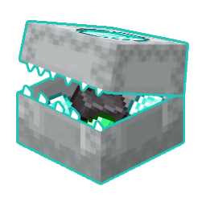

# Better Shulkers

- --
## About
Better Shulkers is an open-source Minecraft mod that enhances shulker boxes with powerful automation features. The mod works completely on the server side, requiring no client modifications, making it perfect for vanilla-compatible servers while also working seamlessly with modded content.

### Key Benefits
- **Server-side only** - No client mod required, works with vanilla clients
- **Vanilla compatible** - Players don't need to install anything
- **Multiple platforms** - Available for Fabric, Quilt, Forge, NeoForge, Sponge, and PaperMC
- **Configurable** - Extensive configuration options for server administrators

### This is Tater Certified's entry in the [2025 NeoForge Server-side Summer](https://neoforged.net/news/2025serversidesummer/) competition!

## Features
This is a brief list of features. More can be found on [our website](https://noramibu.github.io/Better-Shulkers/):
- **Open shulker boxes from anywhere** - Right-click shulker boxes in your hand or inventory to open them without placing them
- **Automatic item pickup** - Shulker boxes can automatically pick up items that match their assigned material
- **Material assignment** - Assign materials to shulker boxes using either crafting recipes or enchantments
- **Visual material display** - See what material a shulker box is assigned to via visual displays on the box
- **Server-side only** - Works completely on the server with no client mod required
- **Vanilla compatible** - Works with vanilla Minecraft clients

## Downloads
Download Better Shulkers from [Curseforge](https://www.curseforge.com/minecraft/mc-mods/better-shulkers) or [Modrinth](https://modrinth.com/mod/better-shulkers).
The mod is compatible with Minecraft 1.21 and above.

## Showcase Video

## Configuration Options
The mod utilizes gamerules for configuration

| Option                          | Default | Description                                                                                                                 |
|---------------------------------|---------|-----------------------------------------------------------------------------------------------------------------------------|
| `insert_into_shulker_on_pickup` | `true`  | If true, items can go into material shulkers when picked up                                                                 |
| `open_shulkers_from_inventory`  | `true`  | If true, players can open shulker boxes by right-clicking them in their inventory                                           |
| `open_shulkers_from_hotbar`     | `true`  | If true, players can open shulker boxes by right-clicking while holding them                                                |
| `shulker_display_animations`    | `true`  | If true, material displays will be animated when opening and closing a shulker. Disable this if the animation appears laggy |
| `shulker_material_displays`     | `true`  | If true, shulker boxes will have item displays above them showing what material it is                                       |
| `shulker_material_enchantment`  | `true`  | If true, shulker boxes can be enchanted with the Material Collector enchantment for material assignment                     |
| `shulker_material_recipe`       | `false` | If true, shulker boxes can be assigned materials using the crafting recipe mentioned below                                  |

## How It Works

#### Material Assignment Methods

**Recipe Method:**
- Place a shulker box in the center of a crafting table
- Surround it with 4 obsidian blocks in the corners
- Place the desired material item in the remaining 4 slots
- This creates a shulker box that will automatically pick up that material

**Enchantment Method:**
- First, obtain the "Material Collector" enchantment through these methods:
  - **Trading:** Librarian villagers may offer enchanted books with this enchantment
  - **Loot:** Found in various loot chests throughout the world
- Apply the enchantment to a shulker box using an anvil
- Then use the anvil to combine the enchanted shulker with the desired material item
- This creates a shulker box that will automatically pick up that material

---

## Supported Platforms (As of v2.0.0)
- Fabric/Quilt (1.21 - 1.21.6, 26.1.x)
- Forge (26.1.x)
- NeoForge (1.21 - 1.21.6, 26.1.x)
- PaperMC/Spigot/Folia (26.1.x)
- Sponge (26.1.x)

---

# Installation
## Fabric, Quilt, Forge, NeoForge
Simply put the mod in the mods folder
## Sponge
Simply put the plugin in the plugins folder
## Spigot/PaperMC
1. Install the [Ignite](https://github.com/vectrix-space/ignite) Mixin loader
2. Run the ignite jar alongside the paper/spigot jar
3. Put the mod in the mods folder and restart
## Folia
1. Install the [Ignite](https://github.com/vectrix-space/ignite) Mixin loader
2. Rename the Folia jar to "paper.jar". Alternatively, you can launch the game with the following JVM args: `-Dignite.locator=paper -Dignite.jar=./folia.jar`
3. Run the ignite jar alongside the folia jar
4. Put the mod in the mods folder and restart

---

## Need Help?
Just join our Discord server!

## Credits
|                                                                                                                                                                       | Name            | Role                             |
|-----------------------------------------------------------------------------------------------------------------------------------------------------------------------|:----------------|:---------------------------------|
|                                                             | noramibu         | Developer                        |
|                                                           | qpcrummer       | Developer                        |
|  | Tater Certified | Contributing Organization        |
